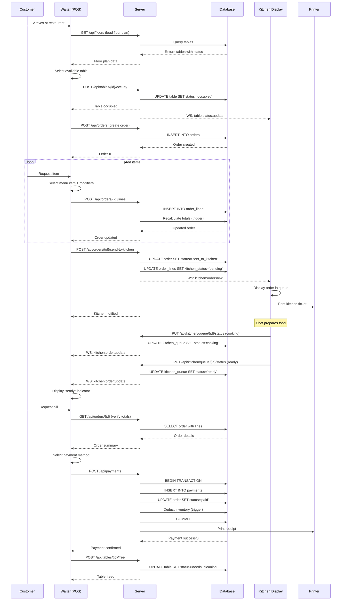
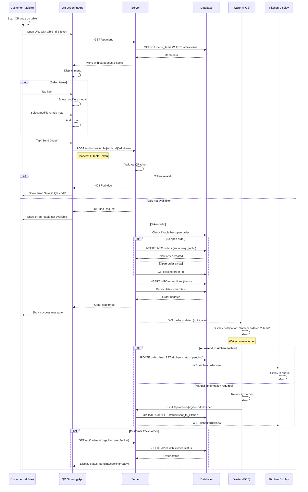
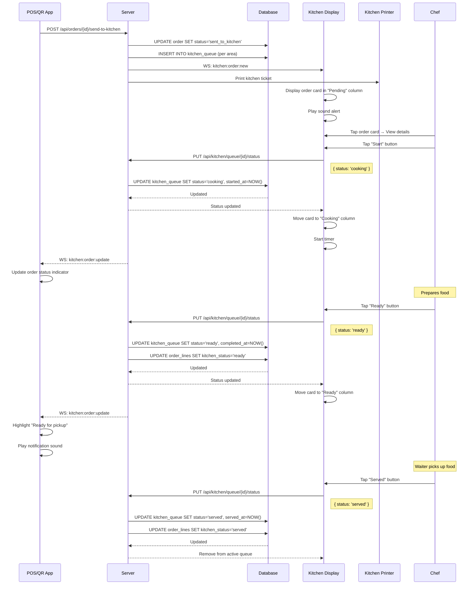
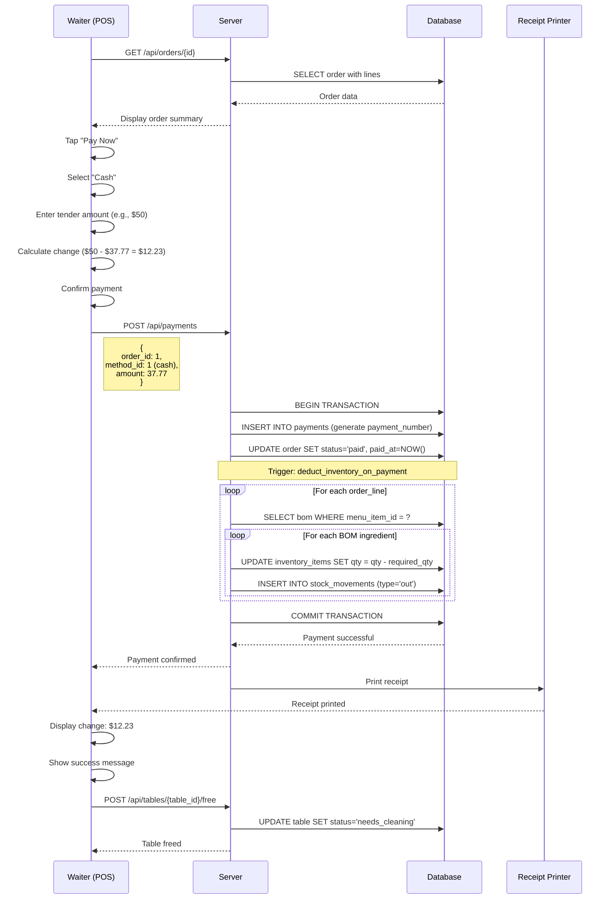
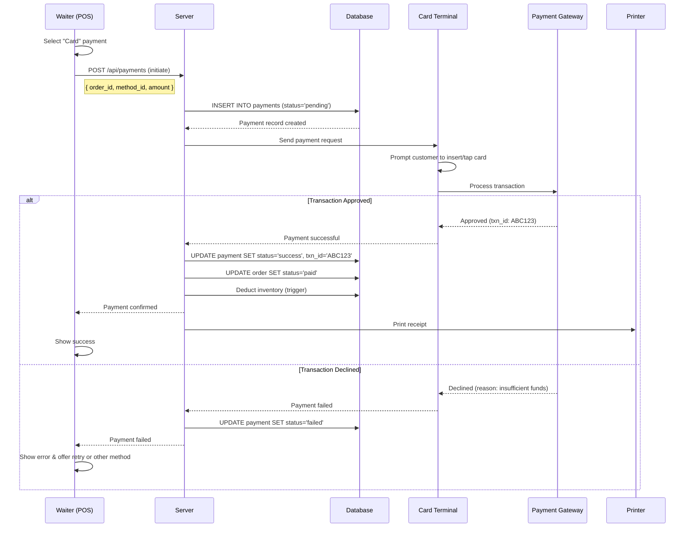
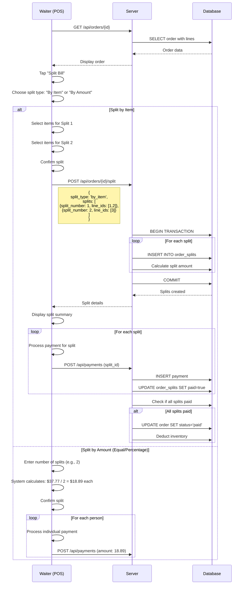
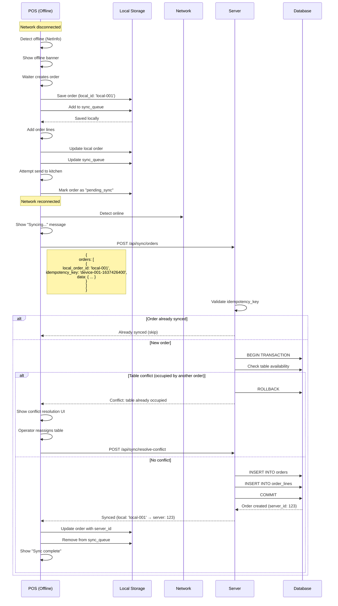
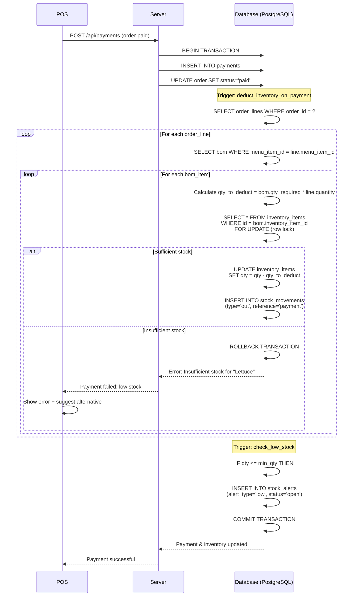
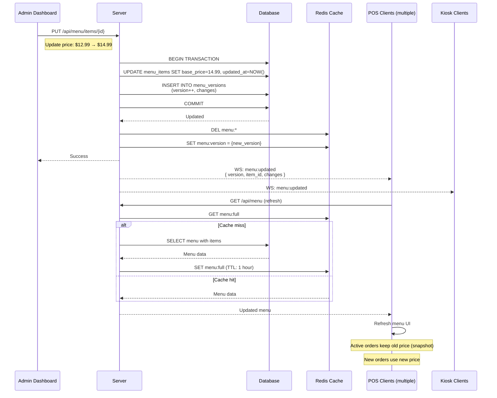
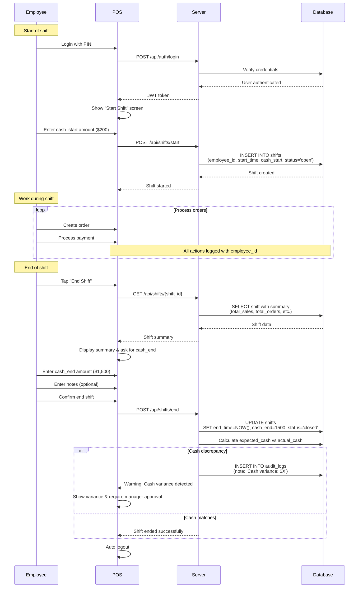

# Workflow Diagrams & Sequence Flows

## 📊 Visual Workflows

This document provides detailed sequence diagrams and flowcharts for all major business processes in the restaurant management system.

---

## 1. Walk-in Dine-in Flow

### Sequence Diagram



### Flowchart

```
┌─────────────────┐
│ Customer Arrives│
└────────┬────────┘
         │
         ▼
┌─────────────────┐
│ Waiter Selects  │
│ Available Table │
└────────┬────────┘
         │
         ▼
┌─────────────────┐
│  Create Order   │
└────────┬────────┘
         │
         ▼
    ┌────────┐
    │ Add    │◄────────┐
    │ Items  │         │
    └───┬────┘         │
        │              │
        ▼              │
    ┌────────┐         │
    │ More?  ├─Yes─────┘
    └───┬────┘
        │ No
        ▼
┌─────────────────┐
│ Send to Kitchen │
└────────┬────────┘
         │
         ▼
┌─────────────────┐
│ Kitchen Prepares│
└────────┬────────┘
         │
         ▼
┌─────────────────┐
│ Customer Eats   │
└────────┬────────┘
         │
         ▼
┌─────────────────┐
│ Request Bill    │
└────────┬────────┘
         │
         ▼
┌─────────────────┐
│ Process Payment │
└────────┬────────┘
         │
         ▼
┌─────────────────┐
│ Free Table      │
└─────────────────┘
```

---

## 2. QR Code Table Ordering Flow ⭐

### Sequence Diagram



### Flowchart

```
┌─────────────────┐
│ Customer Scans  │
│   Table QR Code │
└────────┬────────┘
         │
         ▼
┌─────────────────┐
│  Validate Token │
└────┬────────────┘
     │
     ├─Invalid──► [Show Error]
     │
     │ Valid
     ▼
┌─────────────────┐
│  Load Menu      │
└────────┬────────┘
         │
         ▼
    ┌────────┐
    │ Select │◄────────┐
    │ Items  │         │
    └───┬────┘         │
        │              │
        ▼              │
    ┌────────┐         │
    │ More?  ├─Yes─────┘
    └───┬────┘
        │ No
        ▼
┌─────────────────┐
│  Send Order     │
└────────┬────────┘
         │
         ▼
    ┌────────┐
    │ Has    │
    │ Order? │
    └───┬────┘
        │
        ├─No──► [Create New Order]─┐
        │                          │
        │ Yes                      │
        ▼                          │
    [Append to                     │
     Existing Order]               │
        │                          │
        └──────────┬───────────────┘
                   │
                   ▼
            ┌──────────┐
            │ Notify   │
            │ Waiter   │
            └─────┬────┘
                  │
                  ▼
            ┌──────────┐
            │Auto-send?│
            └─────┬────┘
                  │
         ├─Yes───┴───No─┐
         │               │
         ▼               ▼
    [Send to       [Waiter
     Kitchen]       Confirms]
         │               │
         └───────┬───────┘
                 │
                 ▼
          [Kitchen Prepares]
```

### Security Considerations

1. **QR Token Validation**:
   - Token must match table's `qr_code_token` in DB
   - Token should be rotated periodically (e.g., daily or per session)
   - Invalid token → reject request immediately

2. **Rate Limiting**:
   - Limit orders per table per time window (e.g., 20 orders per 5 minutes)
   - Prevent spam/abuse

3. **Table Status Check**:
   - If table status is `needs_cleaning` or `available` → show message "Please call a waiter"
   - Only allow ordering when table is `occupied` or `reserved`

---

## 3. Kitchen Workflow

### Sequence Diagram



### Kitchen Display States

```
┌───────────┐   ┌───────────┐   ┌───────────┐   ┌───────────┐
│ PENDING   │   │ COOKING   │   │  READY    │   │  SERVED   │
├───────────┤   ├───────────┤   ├───────────┤   ├───────────┤
│ ┌───────┐ │   │ ┌───────┐ │   │ ┌───────┐ │   │           │
│ │ORD-001│ │   │ │ORD-003│ │   │ │ORD-005│ │   │  (Empty)  │
│ │Table 5│ │   │ │Table 2│ │   │ │Table 8│ │   │           │
│ │10:35  │ │   │ │⏱ 8min │ │   │ │✓ Ready│ │   │           │
│ │       │ │   │ │       │ │   │ │       │ │   │           │
│ │[START]│ │   │ │[READY]│ │   │ │[SERVE]│ │   │           │
│ └───────┘ │   │ └───────┘ │   │ └───────┘ │   │           │
└───────────┘   └───────────┘   └───────────┘   └───────────┘
      │               │               │               │
      └───────────────┴───────────────┴───────────────┘
                Drag/Tap to move →
```

---

## 4. Payment Flow (Cash)

### Sequence Diagram



---

## 5. Payment Flow (Card Terminal)

### Sequence Diagram



---

## 6. Split Bill Flow

### Sequence Diagram



---

## 7. Offline Mode & Sync Flow

### Sequence Diagram



### Conflict Resolution UI

```
┌─────────────────────────────────────┐
│  ⚠️ Sync Conflict Detected          │
├─────────────────────────────────────┤
│  Order: local-001                   │
│  Issue: Table 5 is already occupied │
│         by Order #ORD-2025-050      │
│                                     │
│  Options:                           │
│  ○ Reassign to another table        │
│  ○ Merge with existing order        │
│  ○ Cancel this order                │
│                                     │
│  [Resolve] [Skip]                   │
└─────────────────────────────────────┘
```

---

## 8. Inventory Deduction Flow

### Sequence Diagram



---

## 9. Menu Update Propagation

### Sequence Diagram



---

## 10. Shift Management Flow

### Sequence Diagram



---

## 11. Error Handling & Recovery Flows

### Payment Failure Recovery

```
┌─────────────────┐
│ Process Payment │
└────────┬────────┘
         │
         ▼
    ┌────────┐
    │ Call   │
    │ Gateway│
    └───┬────┘
        │
        ├─Success──► [Mark Paid] ──► [Print Receipt]
        │
        │ Failure
        ▼
┌──────────────────┐
│ Determine Reason │
└────────┬─────────┘
         │
         ├─Card Declined──► [Offer Retry / Other Method]
         │
         ├─Network Error──┐
         │                │
         ├─Timeout────────┤
         │                ▼
         │         ┌──────────────┐
         │         │ Save to      │
         │         │ Retry Queue  │
         │         └──────┬───────┘
         │                │
         │                ▼
         │         [Background Retry]
         │                │
         │                ├─Success──► [Update Payment]
         │                │
         │                └─Fail after N retries──► [Manual Intervention]
         │
         └─Gateway Error──► [Log Error] ──► [Contact Support]
```

### Kitchen Printer Offline

```
┌─────────────────┐
│ Send to Kitchen │
└────────┬────────┘
         │
         ▼
    ┌────────┐
    │ Print  │
    │ Ticket │
    └───┬────┘
        │
        ├─Success──► [Done]
        │
        │ Printer Offline
        ▼
┌──────────────────┐
│ Save to Print    │
│ Queue            │
└────────┬─────────┘
         │
         ▼
┌──────────────────┐
│ Notify Manager:  │
│ "Printer offline"│
└────────┬─────────┘
         │
         ▼
┌──────────────────┐
│ Display on       │
│ Kitchen Screen   │
│ (fallback)       │
└────────┬─────────┘
         │
         ▼
    ┌────────┐
    │ Retry  │◄─────┐
    │ Print  │      │
    └───┬────┘      │
        │           │
        ├─Success───┴──► [Done]
        │
        └─Still Offline──► [Continue with screen only]
```

---

## 12. Data Flow Overview

```
┌─────────────┐
│             │
│  POS Tablet │────────┐
│             │        │
└─────────────┘        │
                       │
┌─────────────┐        │     ┌──────────────┐
│             │        │     │              │
│ QR Ordering │────────┼────►│   Backend    │◄────┐
│             │        │     │   (Node.js)  │     │
└─────────────┘        │     │              │     │
                       │     └──────┬───────┘     │
┌─────────────┐        │            │             │
│             │        │            │             │
│   Kiosk     │────────┘            ▼             │
│             │              ┌──────────────┐     │
└─────────────┘              │              │     │
                             │  PostgreSQL  │     │
┌─────────────┐              │   Database   │     │
│             │              │              │     │
│   Kitchen   │◄─────────────┤              │     │
│   Display   │              └──────────────┘     │
│             │                                   │
└─────────────┘              ┌──────────────┐     │
                             │              │     │
┌─────────────┐              │    Redis     │─────┘
│             │              │   (Cache &   │
│   Admin     │◄─────────────┤   PubSub)    │
│  Dashboard  │              │              │
│             │              └──────────────┘
└─────────────┘

     │                          ▲
     │                          │
     │        WebSocket         │
     │      (Realtime Events)   │
     └──────────────────────────┘
```

---

## 13. State Transitions

### Order Status

```
┌────────┐
│  open  │
└───┬────┘
    │
    ▼
┌──────────────────┐
│ sent_to_kitchen  │
└───┬──────────────┘
    │
    ▼
┌────────┐
│ ready  │
└───┬────┘
    │
    ▼
┌────────┐     ┌───────────┐
│  paid  │────►│ completed │
└───┬────┘     └───────────┘
    │
    ▼
┌───────────┐
│ cancelled │
└───────────┘
```

### Table Status

```
┌───────────┐
│ available │
└─────┬─────┘
      │
      ▼
┌──────────┐     ┌──────────┐
│ reserved │────►│ occupied │
└──────────┘     └────┬─────┘
                      │
                      ▼
               ┌────────────────┐
               │ needs_cleaning │
               └────────┬───────┘
                        │
                        └──────►[available]
```

### Kitchen Item Status

```
┌─────────┐
│ pending │
└────┬────┘
     │
     ▼
┌─────────┐
│ cooking │
└────┬────┘
     │
     ▼
┌─────────┐
│  ready  │
└────┬────┘
     │
     ▼
┌─────────┐
│ served  │
└─────────┘

     │
     └──► [cancelled] (any stage)
```

---

## 📝 Notes

- All timestamps use UTC and are converted to local time in frontend
- All monetary amounts stored with 2 decimal precision
- Idempotency keys format: `{device_id}-{timestamp}` for offline sync
- WebSocket reconnection: exponential backoff (1s, 2s, 4s, ..., max 30s)
- Audit logs are immutable and include IP address, user agent

---

**Version**: 1.0.0  
**Last Updated**: 2025-11-20
